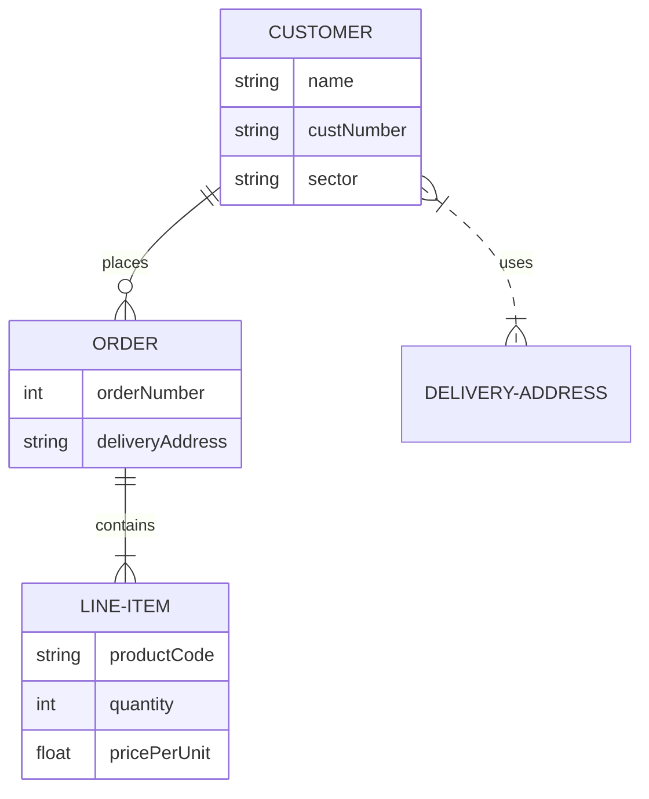

### 操作概要  
- 1 ショップニュース一覧取得（TOP)  
    | 取得条件 |
    |:---------------------------------------------------|
    | ショップニュース.XXXX　＝　対象のLAXA施設コード（固定） |
    | ショップニュース.BBBB　＝　shopnews（固定） |
    | ショップニュース.CCCC　＝　1：配信する |
    | ショップニュース.掲載開始日時　\<= 本日日付 \<= ショップニュース.掲載終了日時 |

    取得項目
    | テーブル | 項目 | 入稿画面項目 |
    |:------------|:--------|:--------|
    | ショップニュース | ファイル名 | 自動採番 |
    | ショップニュース | 画像１ | ニュース画像１ |
    | ショップニュース | 掲載開始日 | 掲載開始日 |
    | ショップニュース | アイコン | アイコン |
    | ショップニュース | ページタイトル | タイトル |

    ソート順
    | テーブル | 項目 | 昇順　/　降順 |
    |:------------|:----------|:--------|
    | ショップニュース | 掲載順ソート用NO | 降順 |
    | ショップニュース | ID | 降順 |

※上位　4件のみ取得、受領した画面イメージより画面には4件のみ表示させる。  

## 故障票一覧表（詳細版）

| 故障番号 | 故障概要 | 詳細内容 | 処理状態 | 発生工程 | 重要度 | 故障種別 | 処理機能 | バグ原因 | 発出者 | 担当者 | 登録日時 | 更新日時 | 対処内容 | 根本原因 | 再発防止策 |
|---------|---------|---------|---------|---------|--------|---------|---------|---------|--------|--------|----------|----------|---------|---------|----------|
| UT20000001 | ログイン認証エラー | 【発現環境】Chrome最新版、Windows11 【再現手順】①トップ画面を開く ②ユーザーIDとパスワードを入力 ③ログインボタンを押下 【事象】認証失敗のエラーメッセージが表示される 【期待値】正常にログインできること | 01 | 02 | 1 | 01 | 01 | A | user001 | nttd-yamada | 2024-01-12 09:30:00 | 2024-01-12 15:45:00 | 認証ロジックの修正を実施。セッション管理の見直しを行い、タイムアウト処理を改善しました。 | パスワード暗号化処理の実装ミス | セキュリティレビューの強化、単体テストケースの追加 |
| UT20000002 | データ保存失敗 | 【発現環境】Firefox、macOS Sonoma 【再現手順】①データ入力画面を開く ②必須項目をすべて入力 ③保存ボタンを押下 【事象】「保存に失敗しました」というエラーが表示され、データが保存されない 【期待値】データが正常に保存されること | 02 | 03 | 2 | 02 | 04 | B | user002 | nttd-suzuki | 2024-01-12 10:15:00 | 2024-01-13 11:20:00 | データベーストランザクション処理を修正。ロールバック処理を追加し、エラーハンドリングを強化しました。 | トランザクション範囲の設定ミス | データベース設計レビューの実施、異常系テストの追加 |
| UT20000003 | 画面レイアウト崩れ | 【発現環境】Safari、iPhone14 Pro 【再現手順】①メニュー画面を開く ②画面を縦横に回転させる 【事象】ボタンが画面外に配置され、操作できない 【期待値】すべての要素が画面内に収まること | 03 | 04 | 3 | 06 | 03 | D | user003 | nttd-tanaka | 2024-01-12 11:00:00 | 2024-01-12 16:30:00 | レスポンシブデザインを修正。メディアクエリを追加し、フレックスボックスレイアウトに変更しました。 | モバイル端末でのテスト不足 | 実機テストの徹底、デザインガイドラインの作成 |
| UT20000004 | API通信タイムアウト | 【発現環境】本番環境、Azure VM 【再現手順】①データ検索画面を開く ②検索条件に大量のデータを含む条件を設定 ③検索ボタンを押下 【事象】30秒後にタイムアウトエラーが発生 【期待値】検索結果が正常に表示されること | 01 | 05 | 1 | 02 | 02 | C | user004 | nttd-watanabe | 2024-01-12 12:30:00 | 2024-01-14 10:00:00 | クエリのパフォーマンスチューニングを実施。インデックスを追加し、ページング処理を導入しました。 | データベースクエリの最適化不足 | パフォーマンステストの実施、負荷テスト基準の策定 |
| UT20000005 | ファイルアップロード失敗 | 【発現環境】Edge、Windows10 【再現手順】①ファイルアップロード画面を開く ②10MB以上のファイルを選択 ③アップロードボタンを押下 【事象】「ファイルサイズが大きすぎます」というエラーが表示される 【期待値】最大50MBまでアップロードできること | 02 | 03 | 2 | 01 | 04 | A | user005 | nttd-kobayashi | 2024-01-12 13:45:00 | 2024-01-13 14:15:00 | サーバー側のファイルサイズ制限を50MBに変更。nginx設定も合わせて修正しました。 | 設計書の記載ミス | 設計レビューの強化、チェックリストの整備 |
| UT20000006 | メール送信エラー | 【発現環境】Gmail SMTP、本番環境 【再現手順】①通知設定画面を開く ②メール通知を有効にする ③テスト送信を実行 【事象】SMTPエラーコード550が返される 【期待値】メールが正常に送信されること | 03 | 02 | 1 | 05 | 05 | E | user006 | nttd-ito | 2024-01-12 14:20:00 | 2024-01-15 09:30:00 | SMTP認証情報を更新。TLS/SSL設定を見直し、エラーハンドリングを追加しました。 | 環境変数の設定ミス | 環境構築手順書の整備、自動化テストの追加 |
| UT20000007 | 検索結果ソートエラー | 【発現環境】Chrome、Windows11 【再現手順】①検索結果画面を開く ②日付順でソートを実行 【事象】ソート順が期待と異なる 【期待値】日付の降順で正しくソートされること | 01 | 04 | 2 | 02 | 02 | B | user007 | nttd-nakamura | 2024-01-12 15:00:00 | 2024-01-13 16:00:00 | ソートロジックを修正。日付フォーマットの統一を実施し、比較処理を改善しました。 | 日付型の処理誤り | コードレビューの徹底、単体テストの追加 |
| UT20000008 | セッションタイムアウト処理不備 | 【発現環境】Safari、macOS Ventura 【再現手順】①ログイン後、30分間操作しない ②画面操作を試みる 【事象】エラー画面が表示される 【期待値】ログイン画面にリダイレクトされること | 02 | 05 | 3 | 01 | 01 | D | user008 | nttd-kimura | 2024-01-12 16:30:00 | 2024-01-14 11:45:00 | セッション管理機能を強化。タイムアウト時の処理を改善し、ユーザーに適切なメッセージを表示するよう修正しました。 | セッション管理の設計不足 | セキュリティ要件の明確化、異常系テストの追加 |
| UT20000009 | PDF出力レイアウト崩れ | 【発現環境】Chrome、Windows10 【再現手順】①レポート画面を開く ②PDF出力ボタンを押下 【事象】表の罫線が途中で切れる 【期待値】レイアウトが正しく出力されること | 03 | 03 | 2 | 06 | 03 | C | user009 | nttd-hayashi | 2024-01-12 17:15:00 | 2024-01-13 15:30:00 | PDF生成ライブラリを更新。ページブレーク処理を改善し、テーブルの描画ロジックを修正しました。 | ライブラリの使用方法誤り | 技術調査の徹底、設計書への記載強化 |
| UT20000010 | データベース接続エラー | 【発現環境】本番環境、PostgreSQL 14 【再現手順】①アプリケーション起動時 【事象】データベース接続プールが枯渇する 【期待値】安定してデータベースに接続できること | 01 | 05 | 1 | 02 | 04 | E | user010 | nttd-yamaguchi | 2024-01-13 08:00:00 | 2024-01-15 13:00:00 | コネクションプール設定を最適化。最大接続数を増やし、タイムアウト値を調整しました。また、未クローズ接続の検出処理を追加しました。 | リソース管理の設計不足 | インフラ設計レビューの実施、監視アラートの設定 |
| UT20000011 | 入力バリデーションエラー | 【発現環境】Firefox、Ubuntu 22.04 【再現手順】①入力フォームを開く ②半角カナを入力 ③確認ボタンを押下 【事象】エラーメッセージが表示されない 【期待値】適切なエラーメッセージが表示されること | 02 | 02 | 2 | 01 | 01 | A | user011 | nttd-matsumoto | 2024-01-13 09:30:00 | 2024-01-14 10:15:00 | バリデーションルールを追加。正規表現を修正し、エラーメッセージの表示ロジックを改善しました。 | 入力チェック仕様の確認不足 | 要件定義レビューの強化、テストケースの充実 |
| UT20000012 | キャッシュ削除処理不備 | 【発現環境】Redis、本番環境 【再現手順】①データ更新処理を実行 ②画面を再表示 【事象】古いデータが表示される 【期待値】最新のデータが表示されること | 03 | 04 | 3 | 02 | 04 | C | user012 | nttd-inoue | 2024-01-13 10:45:00 | 2024-01-14 16:00:00 | キャッシュ無効化処理を追加。TTL設定を見直し、データ更新時のキャッシュクリア処理を実装しました。 | キャッシュ戦略の設計不足 | アーキテクチャレビューの実施、性能テストの追加 |
| UT20000013 | CSV出力文字化け | 【発現環境】Excel 2021、Windows11 【再現手順】①データエクスポート画面を開く ②CSV出力を実行 ③Excelで開く 【事象】日本語が文字化けする 【期待値】正しく日本語が表示されること | 01 | 03 | 2 | 05 | 05 | D | user013 | nttd-takahashi | 2024-01-13 11:20:00 | 2024-01-13 17:45:00 | 文字エンコーディングをUTF-8 BOM付きに変更。CSV生成ロジックを修正し、Excel互換性を向上させました。 | 文字コード設計の考慮不足 | 出力仕様の明確化、互換性テストの実施 |
| UT20000014 | 権限チェック漏れ | 【発現環境】本番環境、API Gateway 【再現手順】①一般ユーザーでログイン ②管理者専用APIを直接呼び出す 【事象】権限なしでデータにアクセスできる 【期待値】権限エラーが返されること | 02 | 05 | 1 | 01 | 01 | E | user014 | nttd-sato | 2024-01-13 12:00:00 | 2024-01-16 14:30:00 | 認可処理を全APIに追加。ロールベースのアクセス制御を実装し、セキュリティテストを実施しました。 | セキュリティ要件の実装漏れ | セキュリティレビューの徹底、脆弱性診断の実施 |
| UT20000015 | 非同期処理タイムアウト | 【発現環境】Node.js 18、本番環境 【再現手順】①バッチ処理を起動 ②大量データ処理を実行 【事象】処理が途中で停止する 【期待値】すべてのデータが処理されること | 03 | 04 | 2 | 02 | 02 | B | user015 | nttd-kato | 2024-01-13 13:30:00 | 2024-01-15 10:00:00 | バッチ処理をチャンク処理に変更。タイムアウト値を調整し、リトライ処理を追加しました。 | 非同期処理の設計不足 | パフォーマンス要件の明確化、負荷テストの実施 |

